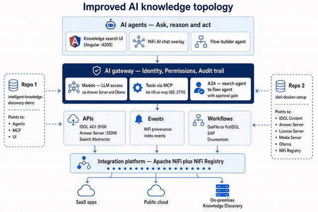

# Intelligent Knowledge Discovery Demo

Unified demo package for OpenText Knowledge Discovery (IDOL). It contains two projects that you can run together or separately.

| Folder | What it is |
|--------|------------|
| `kd-sandbox-ai-demo/` | Intelligent Knowledge Discovery Demo — Angular search UI at **http://localhost:4200** |
| `kd-nifi-ai-mcp/` | NiFi AI chat, MCP server, and orchestrator. MCP is not published to the host. |
| `gateway/` | AI gateway on **http://localhost:27100** — identity, tool allow-list, audit, models vs tools, A2A approval |

Folder names and script names are unchanged so existing commands keep working. You can still `cd` into either project and run it on its own.

Tools and agent-to-agent calls go through the gateway. See [`docs/TOOLS-AND-A2A.md`](./docs/TOOLS-AND-A2A.md) and [`docs/DEPLOY-AND-TEST.md`](./docs/DEPLOY-AND-TEST.md). Pair this repo with `idol-docker-setup` on `idol-demo-network`. Do not start a second NiFi or Ollama. Set the gateway secrets before compose up. From `kd-nifi-ai-mcp` run `./bootstrap-env.sh` or `./up.sh`. That adds missing `GATEWAY_API_TOKEN` and `GATEWAY_SHARED_SECRET` lines and replaces the lab NiFi password. Do not use `OpenText2026!`.

The original merge spec is in [`REQUEST.md`](./REQUEST.md).

---

## Quick start

From this package root (the folder that contains `install.sh`):

```bash
chmod +x install.sh undeploy.sh cleanup.sh scripts/colors.sh \
         kd-nifi-ai-mcp/start.sh kd-nifi-ai-mcp/ui/docker-entrypoint.sh \
         kd-nifi-ai-mcp/scripts/configure_orchestrator_public_url.sh \
         kd-sandbox-ai-demo/apps/web/serve.sh

./install.sh
```

`install.sh` always deploys the search UI. It then asks what to do with NiFi AI:

```
1) Deploy locally          → Docker Compose project  kd-nifi-ai-mcp
2) Use an external NiFi    → Docker Compose project  kd-nifi-ai-mcp-ext
3) Skip NiFi AI            → hide the "NiFi AI" button
```

When start finishes:

1. Open **http://localhost:4200/**
2. Sign in to the demo
3. If NiFi AI was included, use the **NiFi AI** header button
4. The button opens an in-page overlay on the current page. It does not change the URL and does not open a new tab.

## Deployed

After install finishes, the running stack is the topology below. The clip is muted (no audio track) and loops in the page.



Search UI stays on port 4200. NiFi AI is the in-page overlay. Agent and tool calls go through the gateway on port 27100. IDOL, Answer Server, and NiFi stay on the shared `idol-demo-network`.

Scripts print colorized status lines. Set `NO_COLOR=1` to disable colors.

---

## Server-side runtime (required)

Windows is a **client only**. Do not install, build, start, or host application
services on Windows (no Windows Node, npm, Angular CLI, Docker Engine,
PowerShell `ng serve`, or Windows Docker Compose).

```
Windows browser  --HTTP/HTTPS-->  Linux / Ubuntu / WSL / VM / Docker host
                                  ├── Frontend (ng serve or nginx)
                                  ├── Backend / admin-config API
                                  ├── IDOL
                                  ├── NiFi
                                  ├── LLM / Ollama
                                  └── Docker
```

`localhost` means the machine running the process. If the UI runs in WSL or a
VM and the browser is on Windows, open the **server** hostname or IP
(`http://<wsl-or-vm-ip>:4200/`), not Windows `localhost`, unless a port is
explicitly forwarded.

`install.sh`, `serve.sh`, `restart.sh`, and `kd-sandbox-ai-demo/deploy.sh`
refuse to start on a Windows-native shell (Git Bash / MINGW / Cygwin). Run
them inside WSL, Linux, or another server environment.

Default NiFi canvas URL (Services Configuration):
`https://172.25.125.123:27111/nifi`

### Non-interactive flags

```bash
./install.sh --nifi none
./install.sh --nifi local
./install.sh --nifi external --nifi-url https://127.0.0.1:8443 \
          --nifi-user admin --nifi-password 'OpenText2026!'
./install.sh --skip-nifi-test   # do not block deploy when /flow/about fails
./install.sh --no-start         # write config / install deps, do not start processes
./install.sh --skip-npm
./install.sh --create-nifi      # with --nifi local, force a new NiFi container
```

---

## What you need

- Node.js 22 LTS (do not use Node 21)
- npm 10+
- Docker, if you deploy NiFi AI
- Python 3, if you probe or start the NiFi AI stack

---

## Compose projects (local vs external NiFi)

| Mode | Compose project name | Creates a NiFi container? |
|------|----------------------|---------------------------|
| Local stack | `kd-nifi-ai-mcp` | Only if none is found, or with `--create-nifi` |
| External URL | `kd-nifi-ai-mcp-ext` | Never — uses the URL you provide |
| Skipped | — | — |

The two project names are different on purpose so a local stack and an external-URL stack cannot overwrite each other's containers.

`install.sh` / `start.sh` probe NiFi (login + `GET /nifi-api/flow/about`) before starting the AI app. A stale example host such as `172.25.125.123` is ignored. Discovery prefers a running Docker container named `idol-demo-idol-nifi-1` on `idol-demo-network`. See [`USER_QUESTIONS.md`](./USER_QUESTIONS.md).

```bash
python3 kd-nifi-ai-mcp/scripts/test_nifi_settings.py   # offline checks
python3 kd-nifi-ai-mcp/scripts/probe_nifi.py --url https://127.0.0.1:8443
```

On every NiFi AI start, `scripts/configure_orchestrator_public_url.sh`
reads the host IPv4. RFC1918 / loopback / link-local addresses are
skipped. A public address is written to
`kd-nifi-ai-mcp/.env` as `ORCHESTRATOR_PUBLIC_URL=http://<ip>:27110`,
the `ui` service is recreated, and
`curl -s http://127.0.0.1:27120/ | grep -o 'http://[^"]*27110'`
confirms the UI picked it up.

The chat window includes a bottom **Activity log** tab (collapsed by
default) that lists traced session events.

Wrapper notes: [`compose/external-nifi/README.md`](./compose/external-nifi/README.md).

The Angular app reads `kd-sandbox-ai-demo/config/nifi-ai.json`
(copied to `apps/web/src/assets/config/` by `sync-config.sh`):

```json
{ "enabled": true, "mode": "local", "uiUrl": "/nifi-ai/?theme=fta" }
```

`enabled: false` hides the header button. The `theme=fta` query value is the demo theme key written by `install.sh` — leave it as-is unless you also change the UI theme handler. Dev proxy `/nifi-ai` forwards to `http://127.0.0.1:27120` so the overlay stays on `localhost:4200`.

---

## Stop services (keep caches)

Stops running processes and compose stacks. Keeps `node_modules`, `.angular` cache, images, and volumes so the next `./install.sh` is fast.

```bash
./undeploy.sh                 # everything this package started
./undeploy.sh --sandbox       # Angular + probe/admin ports only
./undeploy.sh --nifi          # both NiFi AI compose projects
./undeploy.sh --nifi-local    # kd-nifi-ai-mcp
./undeploy.sh --nifi-external # kd-nifi-ai-mcp-ext
./undeploy.sh --all
```

---

## Cleanup (destructive)

Use this when you want a clean tree, not a quick stop.

```bash
./cleanup.sh              # node_modules, dist, caches, logs, .env, __pycache__
./cleanup.sh --volumes    # also docker compose down -v for both NiFi projects
./cleanup.sh --deep       # also delete package-lock.json
./cleanup.sh --dry-run
```

`cleanup.sh` calls `undeploy.sh` first, then deletes caches, and resets `nifi-ai.json` so a stale button cannot appear.

---

## Run the projects separately

Search UI only:

```bash
cd kd-sandbox-ai-demo/apps/web
./serve.sh
```

NiFi AI stack only:

```bash
cd kd-nifi-ai-mcp
./start.sh --nifi-url https://HOST:8443 up --build
```

---

## Layout

```
intelligent-knowledge-discovery-demo/
├── install.sh
├── undeploy.sh
├── cleanup.sh
├── scripts/colors.sh
├── compose/external-nifi/     # distinct compose project kd-nifi-ai-mcp-ext
├── compose/idol-demo/         # IDOL NiFi Unauthorized compose fix
├── docs/tutorials/            # operator step-by-step guides
├── REQUEST.md
├── README.md
├── kd-sandbox-ai-demo/
└── kd-nifi-ai-mcp/
```

---

## Tutorials

Operator guides live in [`docs/tutorials/README.md`](./docs/tutorials/README.md).
Header and page actions use the same pill layout as NiFi AI (`.hdr-btn` / `.op-btn`).

### NiFi AI

- [Create a sample NiFi flow](./docs/tutorials/nifi-ai-sample-flow.md)
- [IDOL 26.3 GetFileSystem → PutIDOL](./docs/tutorials/nifi-ai-idol-26.3-getfilesystem-putidol.md)
- [AI test with Python](./docs/tutorials/nifi-ai-python.md)

### AI Chat

- [Start from a document search](./docs/tutorials/ai-chat-from-document-search.md)
- [New conversation and scope](./docs/tutorials/ai-chat-new-conversation-and-scope.md)
- [Sources and grounded follow-ups](./docs/tutorials/ai-chat-sources-and-follow-ups.md)

### Documents, Experts, profiles

- [Document query guidance](./docs/tutorials/document-query-guidance.md)
- [Turn Experts on and search people](./docs/tutorials/experts-on-and-search.md)
- [Use and train a Community profile](./docs/tutorials/community-profile.md)

### Button layout

- [Header and `.op-btn` map](./docs/tutorials/button-layout.md)

## Acknowledgments

Deep gratitude to **[Vinay Joseph](https://www.linkedin.com/in/vinayjoseph/)** for exceptional technical mentorship and collaboration throughout this project's development. Your expertise and guidance were instrumental in delivering this enterprise-grade solution.

## Development Team

**Oren Attia** — Solution Consulting
[LinkedIn: Oren Attia](https://www.linkedin.com/in/oren-attia)
